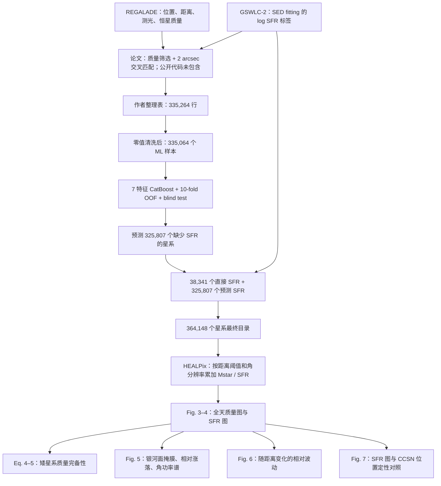

# arXiv:2608.05531：物理链条、公式与复现流程

目标论文：Ye-Hao Cheng, Yuan-Pei Yang, Ye Li, *A Roadmap for Transient Hunters: Mapping Stellar Mass and Star Formation Rate Anisotropies in the Local Universe*, arXiv:2608.05531v1。

本文档给出从公开目录到 ML、HEALPix 天图、角功率谱和 CCSN 对照的完整复现设计。当前状态为：公开输入已经校验并解包；Eq. (5) 已完成独立解析复算；ML 与天图尚未执行；Fig. 5–7 的严格复现仍受公开材料缺口限制。

## 1. 证据等级

本文档使用以下标签区分来源：

- **论文原式**：直接来自 arXiv:2608.05531v1 正文、公式、表格或图注。
- **作者代码**：来自 Zenodo 记录 20695048 的四个 notebook。
- **复现结果**：本工作区已经重新计算并通过测试的结果。
- **拟实现定义**：完成复现所需的标准数学定义；论文没有证明作者采用了同一实现。
- **公开缺口**：现有论文、数据包和代码没有提供足够信息。

这一区分很重要。作者发布的结果文件可以用于核对，但不能代替重新计算；标准定义可以构成我们的基线实现，但不能自动视为论文的原生实现。

## 2. 物理目标

论文希望构造两类局域宇宙全天图：

1. 恒星质量图 $M_\star(\hat{\boldsymbol n},D)$：追踪长期累积的恒星形成历史，更接近 delayed transient progenitors 的空间权重。
2. 恒星形成率图 $\mathrm{SFR}(\hat{\boldsymbol n},D)$：追踪近期形成的短寿命大质量恒星，更接近 CCSN、长伽马暴等 prompt transients 的空间权重。

这些图是沿视线累加到光度距离阈值 $D$ 的内禀物理量总和。它们不是通量图、体积密度图或已经定标的瞬变率图；计算中没有 $1/(4\pi d_L^2)$ 权重，也没有除以像素立体角或壳层体积。

## 3. 主要物理量与单位

| 量 | 定义与单位 | 物理角色 |
|---|---|---|
| $M_\star$ | 星系恒星质量，$M_\odot$；目录保存 `logM = log10(Mstar/Msun)` | 已形成且仍存活于恒星中的累积质量，近似 delayed channel 权重 |
| $\mathrm{SFR}$ | 当前恒星形成率，$M_\odot\,\mathrm{yr}^{-1}$；标签保存 `logSFR = log10(SFR/(Msun/yr))` | 近期大质量恒星形成，近似 prompt channel 权重 |
| $d_L$ | 光度距离，Mpc | 定义累计样本边界 $d_L\le D$；本文不把它作为通量衰减权重 |
| RA, DEC | 赤经、赤纬，deg | 赤道坐标中的 HEALPix 像素定位 |
| $N_{\rm side}$ | HEALPix 分辨率参数 | 决定全天像素数和近似角尺度 |
| $X_p(D)$ | 像素 $p$ 内、距离 $D$ 以内的总 $M_\star$ 或总 SFR | 天图的线性物理量；显示前才取 $\log_{10}$ |
| $\Delta_p$ | $(X_p-\bar X)/\bar X$，无量纲 | 衡量相对平均值的角向不均匀性 |
| $C_\ell$ | 角功率谱，无量纲或依赖输入归一化 | 衡量不同角尺度上的各向异性强度 |

## 4. 公式与物理意义

### 4.1 瞬变率的 A+B 模型：论文 Eq. (1)

**状态：论文原式。** 位置为 §2.1，PDF p.4。

$$
\frac{\mathrm{Rate}(t)}
{10^{-2}\,\mathrm{yr}^{-1}\,\mathrm{galaxy}^{-1}}
=
A\left(\frac{M_\star(t)}{10^{10}\,M_\odot}\right)
+
B\left(\frac{\mathrm{SFR}(t)}{10\,M_\odot\,\mathrm{yr}^{-1}}\right).
\tag{1}
$$

- $\mathrm{Rate}(t)$ 是单星系瞬变率。
- $A$ 和 $B$ 是无量纲系数，分别控制 delayed 与 prompt 分量。
- $M_\star$ 表示积累的恒星形成历史；SFR 表示当前恒星形成活动。
- 该式是完整 delay-time distribution 卷积的经验两分量近似。

物理上，恒星质量图和 SFR 图分别给出 Eq. (1) 两项的空间模板。论文没有给 $A$、$B$ 的数值或拟合方法，因此我们不能从公开材料生成有绝对单位的 transient-rate map。对于寿命很短的 CCSN progenitors，只能使用近似关系

$$
R_{\rm CCSN}(\hat{\boldsymbol n},D)\propto
\mathrm{SFR}(\hat{\boldsymbol n},D),
$$

其比例常数仍未定标。

### 4.2 ML 输入特征：作者代码重建

**状态：作者代码；论文正文只列出特征名称。**

目标量为

$$
S_j\equiv
\log_{10}\!\left(
\frac{\mathrm{SFR}_j}{M_\odot\,\mathrm{yr}^{-1}}
\right).
$$

代码构造四个颜色和 redshift 别名：

$$
c_{g-r}=g-r,
\quad c_{r-z}=r-z,
\quad c_{z-W1}=z-W1,
\quad c_{W1-W2}=W1-W2,
\quad z_{\rm feature}=z.
$$

回归模型可写为

$$
\widehat S_j=
f_{\Theta}\!\left(
g, g-r, r-z, z-W1, W1-W2, z_{\rm feature},
\log_{10}\frac{M_\star}{M_\odot}
\right)_j,
$$

其中 $f_\Theta$ 是 CatBoost 决策树集成，$\Theta$ 表示树分裂和叶节点值。它没有简单的解析物理公式。

按作者超参数，其加法树模型可示意为

$$
\widehat S_i=f_0(\boldsymbol x_i)
+\sum_{t=1}^{1200}0.05\,h_t(\boldsymbol x_i),
$$

其中 $h_t$ 是深度 10 的第 $t$ 棵回归树。作者没有使用 early stopping 或超参数搜索；未显式指定的 CatBoost 默认值会随软件版本变化。

特征的物理作用如下：

- `gmag` 提供光学亮度信息，同时含距离和巡天选择效应。
- `g-r`、`r-z` 描述光学 SED 斜率，受恒星年龄、金属丰度和尘埃共同影响。
- `z-W1` 连接光学与近红外，携带质量光度比和尘埃信息。
- `W1-W2` 描述中红外颜色，可能响应热尘埃、恒星连续谱和 AGN 污染。
- redshift 帮助模型吸收距离、演化及样本选择的系统趋势。
- $\log M_\star$ 提供已积累恒星形成历史的强先验。

CatBoost 学到的是 GSWLC-2 标签与 REGALADE 测光之间的经验关系。它继承 GSWLC-2 SED fitting、测光覆盖和交叉匹配的系统误差；随机 blind split 主要检验同分布插值能力。

#### 清洗与生产模型的两个关键边界

作者代码对原始 dtype 为数值的每一列执行

$$
x'_{ij}=
\begin{cases}
\mathrm{NaN}, & x_{ij}=0,\\
x_{ij}, & x_{ij}\ne0,
\end{cases}
$$

随后只删除目标 `logSFR` 为 NaN 的行。335,264 行训练表中恰有 200 行 `logSFR=0`，因此得到 335,064 行。论文没有说明这项清洗。除非原目录明确把零定义为哨兵，否则

$$
\log_{10}\!\left(\frac{\mathrm{SFR}}{M_\odot\,\mathrm{yr}^{-1}}\right)=0
\quad\Longleftrightarrow\quad
\mathrm{SFR}=1\,M_\odot\,\mathrm{yr}^{-1}
$$

是有效物理值；所以必须先做“原样对齐”，再把零值规则作为科学敏感性实验审计。object 列会整体尝试数值化，`name` 等标识字段因此变成 NaN；缺失特征则保留给 CatBoost 处理。

第二个边界是最终生产模型只在 223,376 行 train-validation 子集上拟合。111,688 行 blind test 从未回灌，随后同一个模型预测 325,807 个无标签星系。因此它是干净的 hold-out 评估设计，但没有利用全部标签重训最终目录模型。

### 4.3 残差、RMSE 与散布：论文 Eqs. (2)–(3)

定义预测残差

$$
\Delta S_j=S_{p,j}-S_{t,j},
$$

其中 $S_{p,j}$ 和 $S_{t,j}$ 分别是预测与真实的 $\log\mathrm{SFR}$，单位为 dex。

论文 Eq. (2) 为

$$
\mathrm{RMSE}=
\sqrt{\frac{1}{m}\sum_{j=0}^{m-1}
\left(S_{p,j}-S_{t,j}\right)^2}.
\tag{2}
$$

它衡量预测误差的总幅度，对大残差采用平方惩罚。所有星系等权。

论文 Eq. (3) 为

$$
\sigma=
\sqrt{\frac{1}{m}\sum_{j=0}^{m-1}
\left(\Delta S_j-\overline{\Delta S}\right)^2}.
\tag{3}
$$

$\sigma$ 衡量去除平均偏差后的残差宽度。作者代码使用 `numpy.std` 的总体标准差约定，即分母为 $m$。

正文和代码还使用

$$
\mathrm{bias}=\overline{\Delta S},
\qquad
\eta=\frac{1}{m}
\sum_j\mathbf{1}\!\left(|\Delta S_j|>3\sigma\right).
$$

代码另外输出

$$
\mathrm{MAE}=\frac{1}{m}\sum_j|\Delta S_j|,
$$

$$
R^2=1-
\frac{\sum_j(S_{t,j}-S_{p,j})^2}
{\sum_j(S_{t,j}-\overline{S_t})^2}.
$$

论文 Table 1 正式发表的验收目标为：

| 样本 | RMSE / dex | bias / dex | $\sigma$ / dex | $\eta$ |
|---|---:|---:|---:|---:|
| 10-fold OOF | 0.306 | -0.0001 | 0.306 | 2.290% |
| blind test | 0.306 | -0.0015 | 0.306 | 2.302% |

作者 Zenodo notebook 另外打印、但论文 Table 1 未发表：

| 样本 | $R^2$ | MAE / dex |
|---|---:|---:|
| 10-fold OOF | 0.763 | 0.197 |
| blind test | 0.760 | 0.196 |

$\sigma\simeq\mathrm{RMSE}$ 源于 bias 接近零。它不意味着每个星系的误差都为 0.306 dex，也不提供样本外巡天系统差异下的泛化误差。

### 4.4 双 Schechter GSMF：论文 Eq. (4)

**状态：论文原式。** 位置为 §4.1，PDF p.10。

$$
\Phi(M)\,dM=
\left[
\phi_1^\ast\left(\frac{M}{M_\ast}\right)^{\beta_1}
+
\phi_2^\ast\left(\frac{M}{M_\ast}\right)^{\beta_2}
\right]
\exp\!\left(-\frac{M}{M_\ast}\right)
\frac{dM}{M_\ast}.
\tag{4}
$$

参数为

$$
\phi_1^\ast=2.93\times10^{-3}\,\mathrm{Mpc}^{-3},
\quad
\phi_2^\ast=0.63\times10^{-3}\,\mathrm{Mpc}^{-3},
$$

$$
M_\ast=10^{10.66}\,M_\odot,
\quad \beta_1=-0.62,
\quad \beta_2=-1.5.
$$

$\Phi(M)dM$ 是质量区间 $[M,M+dM]$ 内的星系数密度，单位 $\mathrm{Mpc}^{-3}$。两个幂律分量描述不同质量区间的低质量端行为，指数截断描述 $M\gtrsim M_\ast$ 时的大质量星系稀缺。

该步骤假设未观测到的矮星系仍服从同一局域 GSMF。它检验的是恒星质量预算，不直接约束矮星系的 SFR 预算。

### 4.5 矮星系恒星质量份额：论文 Eq. (5)

论文写为

$$
f\lesssim
\frac{
\displaystyle\int_{10^5M_\odot}^{\infty}\Phi(M)M\,dM
-
\displaystyle\int_{10^8M_\odot}^{\infty}\Phi(M)M\,dM
}{
\displaystyle\int_{10^5M_\odot}^{\infty}\Phi(M)M\,dM
}
=1.78\%.
\tag{5}
$$

分子等价于 $10^5$–$10^8\,M_\odot$ 星系贡献的恒星质量密度；分母是 $M\ge10^5\,M_\odot$ 的总恒星质量密度。因此 $f$ 是质量份额，不是星系数量份额。

令 $x=M/M_\ast$，每个 Schechter 分量的质量积分为

$$
\int M\Phi(M)\,dM
=M_\ast\sum_{k=1}^2
\phi_k^\ast\int x^{\beta_k+1}e^{-x}\,dx.
$$

**复现结果：** 使用 Eq. (4) 打印的全部参数和 Eq. (5) 的质量边界，通过不完全 Gamma 函数解析积分得到

$$
f_{\rm reproduced}=1.545924113\%,
$$

与论文的 1.78% 相差 $-0.234075887$ 个百分点，或相对低 13.1503%。计算脚本为 `check_dwarf_mass_fraction.py`，对应测试已通过。差异来源目前未知；可能需要作者确认是否存在未写出的参数、质量定义或计算约定。现阶段不得通过调整参数强行对齐 1.78%。

### 4.6 HEALPix 像素数和角尺度：论文 Eq. (6)

$$
N_{\rm pix}=12N_{\rm side}^2,
$$

$$
\theta\sim
\sqrt{\frac{4\pi}{12N_{\rm side}^2}}
=
\sqrt{\frac{\pi}{3N_{\rm side}^2}}.
\tag{6}
$$

$\theta$ 是像素面积平方根对应的近似角尺度，公式自然输出弧度。它不是 HEALPix 像素的精确边长或最大直径。

| $N_{\rm side}$ | $N_{\rm pix}$ | 论文角尺度 |
|---:|---:|---:|
| 1 | 12 | 58.6 deg |
| 2 | 48 | 29.3 deg |
| 4 | 192 | 14.7 deg |
| 8 | 768 | 7.33 deg |
| 16 | 3,072 | 3.66 deg |
| 32 | 12,288 | 1.83 deg |
| 64 | 49,152 | 55 arcmin |
| 128 | 196,608 | 27.5 arcmin |

物理上，$N_{\rm side}$ 选择了瞬变搜索先验图能够表达的最小角结构，并应与望远镜视场匹配。

### 4.7 最高多极矩：论文 Eq. (7)

$$
\ell_{\max}\sim
\frac{\pi}{\theta}
=
\pi\sqrt{\frac{3N_{\rm side}^2}{\pi}}
\approx3N_{\rm side}.
\tag{7}
$$

$\ell$ 越大，对应的角尺度越小。$N_{\rm side}=32$ 和 64 给出 $\ell_{\max}\approx96$ 和 192，与 Fig. 5 横轴范围大致一致。图中横轴印为 `line scale`，正文语义则是 multipole $\ell$。

### 4.8 HEALPix 质量图与 SFR 图：作者代码重建

对每个距离阈值 $D$、每个 $N_{\rm side}$，作者代码使用

$$
p_i=\mathrm{ang2pix}
\left(N_{\rm side},\mathrm{RA}_i,\mathrm{DEC}_i;
\mathrm{lonlat=True},\mathrm{nest=False}\right).
$$

质量图在线性单位中累加：

$$
M_{\star,p}(D)=
\sum_{i:\,d_{L,i}\le D,\,p_i=p}
10^{\mathrm{logM}_i}\,M_\odot.
$$

SFR 图同样在线性单位中累加：

$$
\mathrm{SFR}_{p}(D)=
\sum_{i:\,d_{L,i}\le D,\,p_i=p}
10^{\mathrm{final\_logSFR}_i}
\,M_\odot\,\mathrm{yr}^{-1}.
$$

输出 NPZ 保存的是

$$
V_p=\mathrm{round}\!\left[
\log_{10}\left(\frac{X_p}{X_{\rm unit}}\right),2
\right],
$$

其中 $X_p$ 是质量或 SFR 总和。关键顺序是“先在线性单位求和，再取对数”；直接相加 `logM` 或 `logSFR` 没有物理意义。

两位小数意味着每个非空像素最多有 $0.005$ dex 的量化误差；恢复线性值时对应的最大乘性误差约为

$$
10^{0.005}-1\simeq1.16\%.
$$

作者代码的具体约定：

- 距离阈值为 30–200 Mpc，步长 10 Mpc，共 18 个累计样本。
- $N_{\rm side}=1,2,4,8,16,32,64,128$，每个物理量生成 $8\times18=144$ 个 NPZ。
- 质量图排除 `logM == 0`；SFR 图没有额外有效值筛选。
- 空像素先写入 `1e-10` 哨兵值，绘图时精确替换为 `hp.UNSEEN`。
- 非空像素取 $\log_{10}$ 后四舍五入到 2 位小数。
- 像素采用 RING 排序；RA、DEC 直接作为赤道经纬度输入。

空像素哨兵是文件格式约定，不代表 $\log_{10}X=10^{-10}$ 的真实物理量。复现时要验证哨兵、真实零值和 `hp.UNSEEN` 的转换，不能用默认值掩盖空图。

### 4.9 三 dex 色标：作者绘图代码

绘图 notebook 使用 Mollweide 投影、赤道坐标、`flip='astro'`、灰度色表。若有效像素范围超过三 dex，色标下界采用

$$
V_{\min}=V_{\max}-3.
$$

这是可视化动态范围选择，不改变 NPZ 中的物理数据。当前绘图 notebook 只循环 50、100、150、200 Mpc，而发布的 MASS/SFR 压缩包各含全部 18 个距离阈值的 144 张 PDF；代码版本与发布产品范围存在不一致。

### 4.10 相对涨落：论文未编号公式

排除银河面 $\pm10^\circ$ 后，论文定义

$$
\Delta_p=\frac{X_p-\bar X}{\bar X}.
$$

$X_p$ 是像素内总质量或总 SFR，$\bar X$ 是未掩膜像素平均值。空像素 $X_p=0$ 时 $\Delta_p=-1$。$\Delta_p$ 消除了总量单位，突出空间对比度；附近宇宙的少数高值像素和大量空像素会产生强烈小尺度结构。

这里应使用线性、未量化的 $X_p$。公开 NPZ 保存的是四舍五入后的 $\log_{10}X_p$，论文没有说明 Fig. 5 是否从日志值恢复线性量、直接使用未保存的线性数组，或采用其他中间产品。四个公开 notebook 中也完全没有银河面 mask、$\Delta_p$ 或功率谱实现，所以发布 NPZ 不能证明 Fig. 5 的实际输入约定。

### 4.11 角功率谱：拟实现定义与公开缺口

论文只说明使用 two-point correlation function 计算角功率谱，没有给估计器公式或代码。标准球谐定义可以作为我们的基线：

$$
\Delta(\hat{\boldsymbol n})
=\sum_{\ell m}a_{\ell m}Y_{\ell m}(\hat{\boldsymbol n}),
$$

$$
C_\ell=\frac{1}{2\ell+1}
\sum_{m=-\ell}^{\ell}|a_{\ell m}|^2.
$$

若先估计各向同性的两点相关函数，则标准关系为

$$
w(\theta)=
\left\langle
\Delta(\hat{\boldsymbol n})
\Delta(\hat{\boldsymbol n}')
\right\rangle_{\hat{\boldsymbol n}\cdot\hat{\boldsymbol n}'=\cos\theta},
$$

$$
C_\ell=2\pi\int_{-1}^{1}
w(\arccos\mu)P_\ell(\mu)\,d\mu.
$$

$C_\ell$ 衡量角尺度 $\sim\pi/\ell$ 上的涨落功率。低 $\ell$ 对应全天大尺度不均匀，高 $\ell$ 对应像素级和小尺度团簇结构。

以上是**拟实现定义**，不能声称是作者的原生 estimator。严格复现 Fig. 5 仍缺：

- 银河面掩膜从赤道坐标到 Galactic latitude 的精确转换和边界约定；
- two-point correlation / $C_\ell$ 的具体算法；
- partial-sky mask coupling 或 pseudo-$C_\ell$ 修正；
- monopole、dipole、shot noise、像素窗函数和 binning 处理；
- 输入使用线性图还是日志图的确认。

### 4.12 Fig. 6 的相对波动

正文写出

$$
R_X=\frac{\bar X+\delta X}{\bar X}
=1+\frac{\delta X}{\bar X},
$$

并称 $\delta X$ 是网格值的 root mean square。Fig. 6 纵轴又显示

$$
\log\!\left(\frac{\bar X+\delta X}{\bar X}\right).
$$

该统计量希望表达像素波动相对于平均值的强弱。严格定义仍不完整：

- $\delta X$ 可能是 $\sqrt{N^{-1}\sum X_p^2}$，也可能是 $\sqrt{N^{-1}\sum(X_p-\bar X)^2}$；两者不同。
- 论文没有给 $N_{\rm side}$、掩膜、空像素处理或 log 底数。
- 正文没有写明纵轴的额外 log 变换。

我们将在作者补充定义前并列测试两个 RMS 定义，结果必须标为 sensitivity analysis，不能选取更接近 Fig. 6 的版本作为默认答案。

## 5. 分阶段复现与验收门

| 阶段 | 状态 | 输入 | 主要操作 | 输出与验收 |
|---|---|---|---|---|
| P0：provenance | 已完成 | arXiv v1、Zenodo 8 文件 | 固定版本、大小、MD5、PDF SHA256 | 8 文件全部验证；三个 ZIP 完整性通过 |
| P1：ML / Fig. 2 / Table 1 | 待执行；作者代码可移植 | `Model_training.csv`、`ML_predict.ipynb` | 原样清洗、随机切分、10-fold OOF、只在 2/3 子集 final fit、blind test | 行数、7 特征和表中所有指标按显示精度一致 |
| P2：最终 SFR 目录 | 受控重建 | `Tobe_predicted.csv`、`regalade_knownSFR.csv` | 预测 325,807 行并与 38,341 个直接标签合并 | 总计 364,148；`origin` 两类计数精确一致；逐行核对发布表 |
| P3：Fig. 3–4 天图 | 作者代码可移植 | `Allgalaxy_final_version.csv` | 18 个距离阈值、8 个 $N_{\rm side}$、两个物理量 | 每类 144 NPZ；数组、哨兵、坐标和 2 位小数与发布产品一致 |
| P4：Eq. 4–5 完备性 | 已做解析复算 | GSMF 参数 | 不完全 Gamma 函数质量积分 | 得到 1.545924113%；保留与论文 1.78% 的差异 |
| P5：Fig. 5 $C_\ell$ | 规格不足 | P3 线性图、银河面掩膜 | 构造 $\Delta_p$、定义并实现 estimator | 只能先做标准基线；严格复现等待 estimator 细节 |
| P6：Fig. 6 波动 | 规格不足 | P3 线性图 | 测试两种 RMS 定义及 log 约定 | 作为敏感性分析；不能宣称严格复现 |
| P7：Fig. 7 CCSN | 只能定性重建 | P3 SFR 图、BSN/TNS | 去除 Ia/unclassified、去重、距离筛选、空间对照 | 目录快照缺失；目标计数 302/761/1803 只能作为历史参照 |

### P0：数据与版本

- 论文 PDF：`external_data/literature_sources/arxiv_2608_05531/arxiv_2608.05531v1.pdf`
- PDF SHA256：`7cb7d14d9625d0417edad2e452f13ff0a85b1da4d47911f019f4c25cdd4b305a`
- Zenodo 文件清单：`zenodo_manifest.json`
- 作者代码：`external_data/literature_sources/arxiv_2608_05531/zenodo_20695048/unpacked/code_archive/code/`

### P1：先做 source-level ML reproduction

必须先保持作者代码的科学行为：

1. 原始 CSV 有 335,264 个数据行；作者清洗后为 335,064 行。
2. object 列先把字符串 `null` 设为 NaN，再用 `to_numeric(errors='coerce')`；原本为数值 dtype 的列把 `0.0` 设为 NaN。
3. 只按目标 `logSFR` 删除缺失行；特征 NaN 由 CatBoost 处理。
4. `train_test_split(test_size=1/3, random_state=42, shuffle=True)` 得到 223,376 / 111,688。
5. 训练集使用 `KFold(n_splits=10, shuffle=True, random_state=42)`。
6. CatBoost 固定 `iterations=1200`、`depth=10`、`learning_rate=0.05`、`loss_function='RMSE'`、`random_seed=42`、CPU。
7. 论文 Table 1 的 “Model Training” 实际对应 pooled OOF 预测，而不是模型对训练样本的 in-sample 预测。
8. 最终模型只在 223,376 行 train-validation 上训练；blind 的 111,688 个标签不参与后续外部预测模型。

作者没有发布实际 `requirements.txt`，CatBoost 其余默认参数依赖版本。验收以论文和 notebook 显示精度为准，不要求 bitwise 一致。原生指标对齐后，再逐项测试零值规则、空间分组切分和版本敏感性。

### P2：最终目录

每个星系的最终 SFR 规则应为

$$
S_{\rm final}=
\begin{cases}
S_{\rm GSWLC-2}, & \text{存在直接匹配标签},\\
\widehat S_{\rm CatBoost}, & \text{否则}.
\end{cases}
$$

发布表中 `origin=GSWLC-2` 为 38,341 行，`origin=predicted` 为 325,807 行，没有缺失 `final_logSFR`。作者 notebook 只保存 `Predicted_logSFR.csv`，没有公开最终合并代码，因此该阶段属于 controlled reconstruction；必须逐行与发布的 `Allgalaxy_final_version.csv` 对照。

### P3：天图

每个距离阈值是累计球体而非距离壳层，因此不同 $D$ 的地图高度相关。验收优先比较 NPZ 数组：

- 像素编号与 RING 顺序；
- `ra`、`dec` 像素中心；
- `value` 数组及空像素哨兵；
- 144 个文件的命名、形状和数值；
- 线性求和后取对数并保留两位小数。

四个关键距离的累计样本数还应严格为：50 Mpc 的 15,798、100 Mpc 的 64,427、150 Mpc 的 178,960、200 Mpc 的 364,148。下游 Fig. 5–6 必须从未取对数、未 round 的线性数组重新生成，不能直接把绘图 NPZ 当成无损科学产品。

PDF 视觉相似只能作为后续检查，不能替代数组对比。

## 6. 图表级复现地图

| 论文对象 | 物理问题 | 复现等级 | 当前主要缺口 |
|---|---|---|---|
| Fig. 1 | 50 Mpc 内局域结构在赤道坐标的分布 | 定性重建 | group/cluster 红圈中心与半径未给 |
| Fig. 2 / Table 1 | 7 特征能否预测 GSWLC-2 $\log\mathrm{SFR}$ | source-level port | 环境 lock 缺失，split indices 未保存，200 个目标零值被删除 |
| Fig. 3 | 恒星质量的方向与距离依赖 | native numerical reproduction | 需要移植绝对路径并比较 NPZ |
| Fig. 4 | SFR 的方向与距离依赖 | native numerical reproduction | 同上；最终目录合并代码缺失 |
| Eq. 4–5 | 未观测矮星系影响总质量预算的程度 | analytic reproduction | 当前复算 1.5459%，与 1.78% 不符 |
| Fig. 5 | 各向异性分布在哪些角尺度上最强 | derived baseline | estimator、mask coupling、输入定义缺失 |
| Fig. 6 | 各向异性随距离如何衰减 | sensitivity analysis | RMS 与 log 定义不完整 |
| Fig. 7 | SFR 高值区是否与历史 CCSN 聚集区重合 | qualitative reconstruction | BSN/TNS 快照、去重和宇宙学缺失 |

## 7. 关键物理边界

1. **天图是累计内禀量。** 它们适合作为方向优先级模板；它们没有自动包含望远镜灵敏度、消光、cadence、目标可见性或瞬变光度函数。
2. **质量和 SFR 对应不同时间尺度。** $M_\star$ 汇总长期形成史，SFR 偏向近期大质量恒星；真实 transient rate 仍需 delay-time distribution 或 Eq. (1) 的 $A,B$ 标定。
3. **ML 误差是标签空间误差。** 0.306 dex 衡量相对 GSWLC-2 标签的误差，还包含 SED fitting 和巡天系统误差。
4. **随机切分没有检验天区外推。** 相邻天区、同一巡天和相似选择函数会同时出现在训练与 blind test 中。
5. **零值清洗可能删除有效物理对象。** `logSFR=0` 并不天然等于缺失；这 200 行必须在源目录语义确认后才能决定是否排除。
6. **生产模型只用了 2/3 标签。** 这是作者代码的可复现行为，但应另做“全部标签重训”的部署敏感性实验，且不能拿该实验替代论文结果。
7. **质量完备性不等于 SFR 完备性。** Eq. (5) 只按 $M\Phi(M)$ 加权，没有矮星系 SFR 或 burstiness 模型。
8. **空像素驱动高 $\ell$。** 论文明确指出空像素 $\Delta=-1$ 与少数高值像素形成强对比；这同时意味着结果对目录完备性和像素尺度敏感。
9. **Fig. 7 是历史选择函数卷积后的定性图。** 目标巡天和盲扫巡天混合，不能据此测量无偏的 CCSN–SFR 相关强度。

## 8. 实际执行顺序

1. 明确安装并记录 `.venv` 中 pandas、scikit-learn、CatBoost、healpy 和 Jupyter 的解析版本。
2. 把四个 notebook 的绝对路径参数化；保留作者科学逻辑，移除静默 warning suppression 和空图色标 fallback，使异常显式失败。
3. 在 CPU 节点运行 P1，保存 split indices、fold indices、环境版本、日志和指标 JSON。
4. 对齐 Fig. 2 / Table 1 后再做零值规则和天区分组 split 的科学敏感性实验。
5. 完成 P2 预测与合并，逐行核对发布最终目录。
6. 完成 P3 的 288 个质量/SFR NPZ，并先做数组级比较，再绘图。
7. 将 P5–P7 作为独立工作包；每个缺失定义先报告，再建立清晰标注的标准基线或敏感性分析。

正式复现产品分别保存到：

- 可复用表和 NPZ：`data_save/reproductions/arxiv_2608_05531/`
- 日志、指标和诊断图：`outputs/reproductions/arxiv_2608_05531/`
- 控制参数、公式与方法说明：本目录。

## 9. 当前判断

这篇工作的 ML 和 HEALPix 主链具备较高可复现性，公式和公开数据足以完成 Fig. 2–4 的 source-level port。Eq. (5) 已出现可量化的解析差异。Fig. 5–6 的统计定义和 Fig. 7 的历史目录快照决定了全论文复现的主要难度；这些环节应明确标为 derived baseline、sensitivity analysis 或 qualitative reconstruction，直到作者补充原始实现与数据快照。
